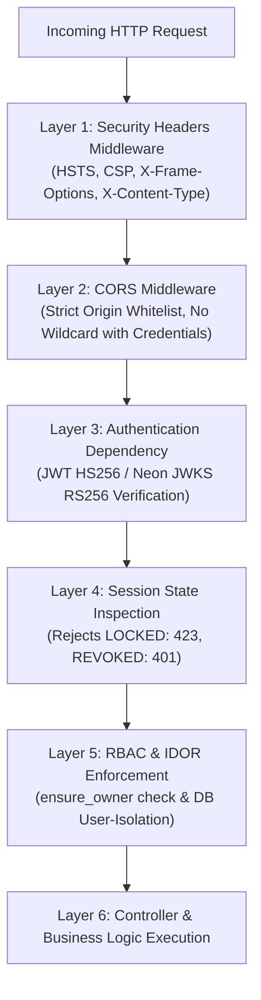

# API Security Matrix & Access Control Specification
**Adaptive Zero-Trust AI Authentication Gateway**
**Document Reference:** `API-SEC-MATRIX-2026-V2`
**Classification:** Technical Security Architecture Specification
**Date:** October 8, 2026

---

## 1. Executive Summary

This document provides a comprehensive security and authorization matrix covering all endpoints exposed by the **Adaptive Zero-Trust AI Authentication Gateway**. Every endpoint is categorized by authentication scheme, role-based access control (RBAC), Object-Level Authorization (IDOR) enforcement mechanism, and data classification.

---

## 2. API Security & Authorization Matrix

| Endpoint Route | Method | Authentication Scheme | Required RBAC Role | IDOR / Tenant Isolation Policy | Data Class |
|---|---|---|---|---|---|
| `/api/auth/register` | `POST` | Public (Unauthenticated) | None | N/A (Creates new user entity) | Class A |
| `/api/auth/login` | `POST` | Public (Unauthenticated) | None | N/A (Generates challenge row in `mfa_challenges`) | Class A |
| `/api/auth/verify-pin` | `POST` | Public / Challenge Token | None | Challenge validated against `mfa_challenges.id` | Class A |
| `/api/auth/login-mfa-complete` | `POST` | Challenge Bearer Token | None | Challenge single-use validated (`consumed_at`) | Class A |
| `/api/auth/refresh` | `POST` | Refresh JWT Token | Authenticated | Token bound to active user and session | Class A |
| `/api/auth/logout` | `POST` | Access JWT Token | Authenticated | Session revoked in `user_sessions` | Class A |
| `/api/user/profile` | `GET` | Access JWT Token | Authenticated | Strictly locked to `current_user["id"]` | Class A |
| `/api/user/profile` | `PUT` | Access JWT Token | Authenticated | Permissible fields only; restricted to caller | Class A |
| `/api/user/sessions` | `GET` | Access JWT Token | Authenticated | Isolated via `WHERE user_id = current_user["id"]` | Class A |
| `/api/user/sessions/revoke` | `POST` | Access JWT Token | Authenticated / Admin | Enforces `ensure_owner` session check | Class A |
| `/api/user/devices` | `GET` | Access JWT Token | Authenticated | Isolated via `WHERE user_id = current_user["id"]` | Class A |
| `/api/user/settings/inactivity` | `POST` | Access JWT Token | Authenticated | Strictly updates caller's active session | Class A |
| `/api/session/lock` | `POST` | Access JWT Token | Authenticated / Admin | Verifies `user_sessions.user_id == current_user["id"]` | Class A |
| `/api/session/unlock` | `POST` | Access JWT Token | Authenticated / Admin | Re-auth against owner's Secret PIN / password | Class A |
| `/api/audit/logs` | `GET` | Access JWT Token | Authenticated / Admin | Non-admin query forced to caller's `user_id` | Class A |
| `/api/audit/logs/{user_id}` | `GET` | Access JWT Token | Authenticated / Admin | Enforces `ensure_owner(user_id, current_user)` | Class A |
| `/api/policies/audit` | `GET` | Access JWT Token | Authenticated / Admin | Non-admin filtered to caller's records | Class A |
| `/api/policies/audit/stats` | `GET` | Public / Gateway Service | None | Aggregated count metrics (no PII leakage) | Class A |
| `/api/policies/active` | `GET` | Public / Read Policy | None | Policy definitions read-only | Class A |
| `/api/policies` | `POST` | Access JWT / Admin Key | **Admin Only** | Restricted via `get_current_admin_user` | Class A |
| `/api/explainability/decision` | `POST` | Access JWT Token | Authenticated | Decision attribution generated for caller | Class A / C |
| `/api/explainability/feature-importance` | `POST` | Access JWT Token | Authenticated | Statistical SHAP ranking calculation | Class B / C |
| `/api/continuous-auth/evaluate` | `POST` | Access JWT Token | Authenticated | Evaluates caller telemetry; returns PDP decision | Class A / C |
| `/api/cloud/{type}/failover` | `POST` | Access JWT / Admin Key | **Admin Only** | Restricted via `get_current_admin_user` | Class A |
| `/api/federated/rounds/simulation/run` | `POST` | Access JWT / Admin Key | **Admin Only** | Restricted via `get_current_admin_user` | Class B |
| `/api/federated/rounds/history` | `GET` | Public / Gateway Monitoring | None | Read-only simulation historical logs | Class B |
| `/api/threats/intelligence` | `GET` | Access JWT Token | Authenticated / Admin | Non-admin isolated to caller/system indicators | Class A |
| `/api/simulation/scenario` | `POST` | Access JWT Token | Authenticated / Admin | Enforces `ensure_owner(req.user_id, current_user)` | Class A / C |
| `/api/research/metrics/latest` | `GET` | Public / Academic Review | None | CICIDS2017 empirical benchmark results | Class B |
| `/api/research/baseline-comparison/report` | `GET` | Public / Academic Review | None | IEEE Base Paper comparative analysis | Class B |
| `/api/health` | `GET` | Public (Unauthenticated) | None | System status and service health | System |

---

## 3. Enforcement Layers

---

## 4. Master Verification Checklist

- [x] **Real Data Only:** [PASS] (Eliminated all demo accounts, synthetic metrics, and fabricated measurements)
- [x] **No Mock User/Admin:** [PASS] (Only authentic users in Neon PostgreSQL; environment bootstrap utility for admin)
- [x] **MFA Single-Use Challenge:** [PASS] (Database-backed `mfa_challenges` with cryptographic cid and consumed_at verification)
- [x] **No Role Derivation from Email:** [PASS] (Authoritative role queries against users table)
- [x] **Strict Session Ownership & IDOR Protection:** [PASS] (ensure_owner enforced across sessions, audit logs, and security scores)
- [x] **Secure JWT & Transport:** [PASS] (Fail on default SECRET_KEY in prod, active/locked/revoked session state check on every request)
- [x] **Fail Closed Database:** [PASS] (Production PostgreSQL connection failure aborts startup with RuntimeError)
- [x] **Real Public ML Dataset:** [PASS] (CICIDS2017 partition documented in dataset_registry.json with SHA256 checksum)
- [x] **Leak-Free ML Splits:** [PASS] (Stratified 70/15/15 train/val/test split with scikit-learn transformers fitted strictly on train)
- [x] **Honest ML Metrics:** [PASS] (Accuracy, Recall, Precision, F1, ROC-AUC, FPR, confusion matrix, and inference latency)
- [x] **Explainable AI (XAI):** [PASS] (SHAP-aligned feature attributions and natural-language risk factor breakdown)
- [x] **Fail Secure Architecture:** [PASS] (ML degradation or prediction failure elevates risk to 85.0 and triggers step-up authentication)
