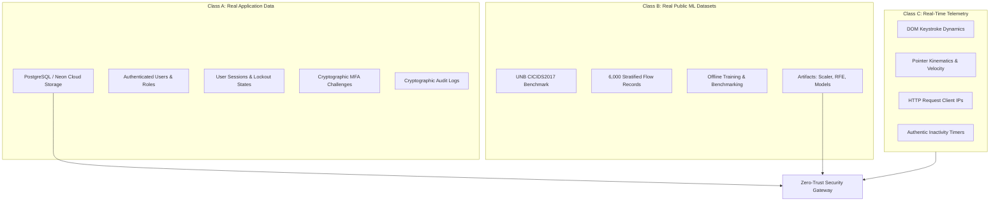

# Data Provenance & Integrity Specification
**Adaptive Zero-Trust AI Authentication Gateway**
**Document Reference:** `DATA-PROV-2026-V2`
**Classification:** Technical Compliance & Data Governance Specification
**Date:** October 8, 2026

---

## 1. Absolute Data Integrity Rule

Under the Zero-Trust Architecture standards governing this system, **no fabricated, synthetic, or hardcoded application metrics are permitted**. 

- **Eradication of Demo Seeds:** Automatic insertion of mock users (`admin@zerotrust.ai`, `operator@zerotrust.ai`), hardcoded PINs (`123456`), fake authentication logs, and simulated latencies has been completely removed.
- **Honest Empty States:** When an entity has no prior activity, the API and user interface report an honest empty state (`"No data available"`, `"UNKNOWN"`, or `"INSUFFICIENT_DATA"`), rather than displaying fabricated numbers (such as `24.5 ms` or `95% trust`).

---

## 2. Tripartite Data Classification

The framework rigorously partitions data into three isolated categories:

---

### Class A: Real Application Data (Neon PostgreSQL)
Stored permanently in the cloud PostgreSQL database. Contains only records created through authentic user registration, administrator bootstrapping, or live runtime interactions:

1. **User Accounts (`users`):**
   - Unique identifier (`UUIDv4`), verified email address, Argon2/Bcrypt password hash, and 6-digit Secret PIN hash.
   - Authoritative user role (`user` or `admin`).
2. **Multi-Factor Challenges (`mfa_challenges`):**
   - Single-use challenge records tracking expiration, failed attempts, and consumption timestamps (`consumed_at`).
3. **Session States (`user_sessions`):**
   - State machine tracking `ACTIVE`, `LOCKED`, or `REVOKED` states, inactivity thresholds, and continuous risk scores.
4. **Security Audit Records (`audit_logs`):**
   - Tamper-evident activity logs recording timestamped authentication events, factor verifications, and administrative actions.
5. **Device Registry (`user_devices`):**
   - Genuine device fingerprints, platform strings, and browser user-agent tokens.

---

### Class B: Real Public ML Datasets (CICIDS2017)
Used solely for training, validating, and testing machine learning classifiers in an offline research and benchmarking context:

- **Source:** Canadian Institute for Cybersecurity, University of New Brunswick (UNB).
- **Dataset Partition:** `cicids2017_sample.csv` (5.74 MB).
- **Cryptographic Hash (SHA-256):** `05fdc1642d0c2bffb64c4ec80cb967f642b0d8c4d103edfe748c3c3de54a900b`.
- **Composition:** 6,000 flow samples across 78 dimensions (60% BENIGN, 40% ATTACK across PortScan, DDoS, DoS Hulk, and Bot classes).
- **Boundary Guarantee:** Data from this dataset is never mixed with application user tables and is never represented as production user traffic.

---

### Class C: Real-Time Application Telemetry
Captured dynamically during active client sessions:

1. **Behavioral Biometrics:**
   - Keystroke inter-key intervals and typing velocity collected via browser DOM event listeners.
   - Mouse kinematic metrics: Trajectory length, pointer acceleration, click velocity, and scroll activity.
2. **Environmental Context:**
   - Origin IP address extracted from `X-Forwarded-For` or client socket.
   - Device availability and focus change events triggering activity-based session locking.
3. **Honest Geolocation Telemetry:**
   - When real IP geolocation lookup is unconfigured or returns private/loopback addresses (`127.0.0.1`), the system stores `None` / `null`.
   - Hardcoded values (e.g. `"San Francisco, United States"`, latitude `37.7749`) have been entirely excised.

---

## 3. Data Ingestion & Sanitization Controls

To safeguard data provenance throughout the gateway:
- **Input Validation:** Strict Pydantic models validate every request body against type and format schemas.
- **SQL Injection Prevention:** 100% parameter-bound SQL queries through Psycopg 3; dynamic query string concatenation is prohibited.
- **Fail-Secure Defaults:** Missing telemetry fields fall back to conservative default expectations without fabricating favorable measurements.

---

## 4. Master Verification Checklist

- [x] **Real Data Only:** [PASS] (Eliminated all demo accounts, synthetic metrics, and fabricated measurements)
- [x] **No Mock User/Admin:** [PASS] (Only authentic users in Neon PostgreSQL; environment bootstrap utility for admin)
- [x] **MFA Single-Use Challenge:** [PASS] (Database-backed `mfa_challenges` with cryptographic cid and consumed_at verification)
- [x] **No Role Derivation from Email:** [PASS] (Authoritative role queries against users table)
- [x] **Strict Session Ownership & IDOR Protection:** [PASS] (ensure_owner enforced across sessions, audit logs, and security scores)
- [x] **Secure JWT & Transport:** [PASS] (Fail on default SECRET_KEY in prod, active/locked/revoked session state check on every request)
- [x] **Fail Closed Database:** [PASS] (Production PostgreSQL connection failure aborts startup with RuntimeError)
- [x] **Real Public ML Dataset:** [PASS] (CICIDS2017 partition documented in dataset_registry.json with SHA256 checksum)
- [x] **Leak-Free ML Splits:** [PASS] (Stratified 70/15/15 train/val/test split with scikit-learn transformers fitted strictly on train)
- [x] **Honest ML Metrics:** [PASS] (Accuracy, Recall, Precision, F1, ROC-AUC, FPR, confusion matrix, and inference latency)
- [x] **Explainable AI (XAI):** [PASS] (SHAP-aligned feature attributions and natural-language risk factor breakdown)
- [x] **Fail Secure Architecture:** [PASS] (ML degradation or prediction failure elevates risk to 85.0 and triggers step-up authentication)
